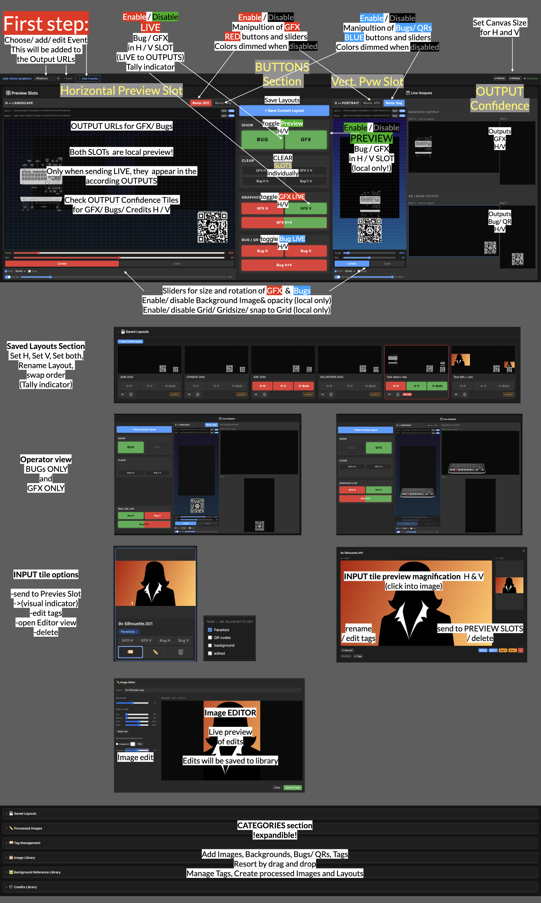

# Office Hours Graphics — Operator Guide

The full operator reference for the show-graphics tool (lower-thirds / bugs / QR codes and full graphics for the Office Hours live shows). For the 30-second version, see the **Quick Reference**. For a labelled screenshot of every control, click **❓ How it works** inside the gallery.

**Gallery:** https://adp-lab.github.io/adp-show-graphics/gallery.html

---

## 1. Before you start

1. **Open the gallery** and **Connect to Worker** (first time only — remembered after):
   - **Worker URL:** `https://adp-show-graphics.mohn-edgar.workers.dev`
   - **API key:** shared separately by André (not in this doc).
2. **Pick the Event** from the dropdown (top-left). Each event has its own image library, layouts, and output URLs. Using the wrong event is the #1 cause of "nothing shows up."

### The preview → live model (the most important concept)
- **Loading an image into a slot = PREVIEW.** It appears in your preview slots and the Live Outputs monitors, but it is **local only** — nothing reaches the show.
- **Pressing SEND LIVE = ON AIR.** Only then does it appear in the actual outputs (vMix browser sources).

This split lets you set up and fine-tune a graphic invisibly, then put it to air with one click.

### Colour language (used on every button)
- 🟢 **Green** = loaded / in preview (ready, not on air)
- 🔴 **Red** = on air (program)
- **Dark** = not loaded / inactive

### H vs V
**H** is the landscape output, **V** is the portrait (vertical) output. They are independent — you load and air them separately. **H+V** buttons act on both at once.

---

## 2. Preview Slots (left = H Landscape, right = V Portrait)

Each slot shows both layers together: **GFX** (full graphics) and **Bug / QR** (the small overlay). Everything here is **local preview** — it never reaches air on its own.

- **Manip. GFX / Manip. Bug tabs** (top of each slot) — choose which layer your controls affect. **Bug is the default.** GFX controls are tinted red, Bug controls blue. Click the active tab again to deactivate (controls dim).
- **Drag** the image in the preview to set its position. You can drag it partly or fully off-frame.
- **Scale** (10–300%) and **Rotate** (−180°…+180°) sliders — click the % or ° label to reset.
- **Contain / Cover** — *Contain* keeps the whole image (may show transparent edges); *Cover* fills the frame (crops, ignores position/scale).
- **Grid** + **Snap** — alignment aid, preview only, never on air.
- **BG Ref** — drop a slide/screen reference behind the graphic to align against. Preview only, never sent to air.

The **output URL row** in each slot shows the GFX and Bug page URLs (with **Open** / **Copy**) — these are what vMix loads as browser sources.

---

## 3. Sending to air (centre panel)

- **GRAPHICS LIVE** — **GFX H**, **GFX V**, **GFX H+V**.
- **BUG / QR LIVE** — **Bug H**, **Bug V**, **Bug H+V**.

A SEND LIVE button is **dark** when the slot is empty, **🟢 green** when an image is loaded but not yet aired, and **🔴 red** when it's **on air**. Press a red button again to take it off air (toggle).

- **CLEAR** (GFX H/V, Bug H/V) — removes the image from that slot and goes transparent immediately (same as airing an empty slot).

---

## 4. Show BUG | GFX — view modes

The two big **SHOW: BUG | GFX** toggles at the top of the centre panel let you focus the workspace:

- **Both on** (default) — Bug and GFX shown side by side.
- **BUG only** (GFX off) — hides the entire GFX UI; the Bug output monitor **enlarges**.
- **GFX only** (BUG off) — hides the entire Bug UI; the GFX output monitor enlarges.

This is **view-only** — it does **not** change what's on air. Use it when you're only operating one layer and want it bigger.

---

## 5. Live Outputs (confidence monitors, right side)

The right column shows live previews of the **actual output pages** — **GFX H / V** and **Bug H / V** — exactly as vMix sees them. **Always glance here to confirm what's really on air.** Click any monitor to magnify it; click again to close. In single-layer view mode the visible monitor enlarges.

---

## 6. Saved Layouts (bottom section)

A layout is a saved snapshot of all four slots.

- **+ Save Current Layout** — saves your current setup under a name.
- On each layout card, **H / V / Both** recall buttons load that layout's content for that orientation.
- **Tally on the recall buttons:** 🟢 green = this layout's content is currently **loaded** (in preview), 🔴 red = it's **on air**, dark = not loaded. (Both is red only when H *and* V are both on air.)
- The card border/badge shows **ACTIVE** (green) when the layout matches what's loaded, **ON AIR** (red) when its content is live.
- **Rename** (✏) / **Delete** (🗑) per card; drag cards to reorder.

---

## 7. Image Library

- **Upload** — click **📤 Upload** or drag files from Finder onto the window. Tag them on upload (categories + free tags). Auto-tag rules can sort by filename.
- **Slot buttons on each tile** — **GFX H / GFX V / Bug H / Bug V** assign the image to that slot. Their colour is the tally: 🟢 loaded/preview, 🔴 on air, dark = not assigned. Click an assigned button again to clear it from the slot.
- **🏷 Tags**, **✏ Image Editor**, **🗑 Delete** per tile. Click a thumbnail to magnify it.
- **Image Editor (✏)** — rotate, crop/trim, and background knock-out (pick a colour + tolerance to make it transparent). **Save as Copy** exports a new image tagged *edited*; the original is untouched.
- **Categories / Background References / Tag Management** — expandable sections for organising images, background references (preview-only), and tag rules.

---

## 8. Adding outputs to vMix

Use each slot's **output URL** as a **Browser Input** in vMix, at the matching resolution:
- **H:** 3840 × 2160 (default) · **V:** 2160 × 3840 (default) — or whatever is set in **⚙ Settings** for the event.

The output pages poll the server about once a second, so a graphic appears on air within ~1–2 seconds of **SEND LIVE** — that delay is normal.

---

## 9. Troubleshooting

| Symptom | Check |
|---|---|
| Graphic not on air | Is its **SEND LIVE** button **red**? Green/dark = preview only — press it. |
| Wrong/old graphic showing | Right **Event** selected? Check the Live Outputs monitor. |
| Nothing in a slot | Load an image from the library (click its GFX/Bug H/V button). |
| Vertical bug looks empty | Use a **portrait/square** QR for the V slot — a landscape image in portrait shows only a thin strip. |
| Preview looks stale after switching tabs | Polling pauses when the gallery tab is hidden (to save server quota) and resumes when you return — give it a second. |
| **⏸ Paused (idle)** badge | The gallery paused its own previews after ~5 min of no activity (saves requests). **Your outputs are still live.** Move the mouse or press a key to resume. |

---

*Tip: keep only one gallery tab open during a show and close idle ones — every open gallery polls the server continuously.*
